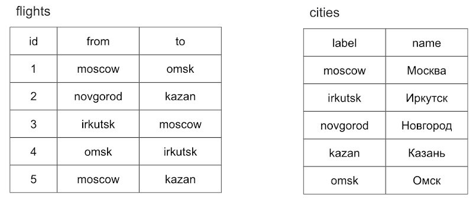

# **MySQL**

## **Lesson 2**
**Практическое задание по теме “Управление БД”:**
- Установите СУБД MySQL. Создайте в домашней директории файл .my.cnf, задав в нем логин и пароль, который указывался при установке.
- Создайте базу данных example, разместите в ней таблицу users, состоящую из двух столбцов, числового id и строкового name.
- Создайте дамп базы данных example из предыдущего задания, разверните содержимое дампа в новую базу данных sample.
- (по желанию) Ознакомьтесь более подробно с документацией утилиты mysqldump. Создайте дамп единственной таблицы help_keyword базы данных mysql. Причем добейтесь того, чтобы дамп содержал только первые 100 строк таблицы.

## **Lesson 3**

1.Написать cкрипт, добавляющий в БД vk, которую создали на 3 вебинаре, 3-4 новые таблицы (с перечнем полей, указанием индексов и внешних ключей).
(по желанию: организовать все связи 1-1, 1-М, М-М)

## **Lesson 4**

- Заполнить все таблицы БД vk данными (по 10-100 записей в каждой таблице).
- Написать скрипт, возвращающий список имен (только firstname) пользователей без повторений в алфавитном порядке.
- Первые пять пользователей пометить как удаленные.
- Написать скрипт, удаляющий сообщения «из будущего» (дата больше сегодняшней).
- Написать название темы курсового проекта.

## **Lesson 5**

**Практическое задание по теме «Операторы, фильтрация, сортировка и ограничение»:**
- Пусть в таблице users поля created_at и updated_at оказались незаполненными. Заполните их текущими датой и временем.
- Таблица users была неудачно спроектирована. Записи created_at и updated_at были заданы типом VARCHAR и в них долгое время помещались значения в формате 20.10.2017 8:10. Необходимо преобразовать поля к типу DATETIME, сохранив введённые ранее значения.
- В таблице складских запасов storehouses_products в поле value могут встречаться самые разные цифры: 0, если товар закончился и выше нуля, если на складе имеются запасы. Необходимо отсортировать записи таким образом, чтобы они выводились в порядке увеличения значения value. Однако нулевые запасы должны выводиться в конце, после всех записей.
- Из таблицы catalogs извлекаются записи при помощи запроса. SELECT * FROM catalogs WHERE id IN (5, 1, 2) Отсортируйте записи в порядке, заданном в списке IN.

**Практическое задание теме «Агрегация данных»:**
- Подсчитайте средний возраст пользователей в таблице users.
- Подсчитайте количество дней рождения, которые приходятся на каждый из дней недели. Следует учесть, что необходимы дни недели текущего года, а не года рождения.

## **Lesson 6**

**Практическое задание по теме “Операторы, фильтрация, сортировка и ограничение. Агрегация данных”:**

- Пусть задан некоторый пользователь. Из всех друзей этого пользователя найдите человека, который больше всех общался с нашим пользователем.
- Подсчитать общее количество лайков, которые получили пользователи младше 11 лет.
- Определить кто больше поставил лайков (всего): мужчины или женщины.

## **Lesson 7**

- Составьте список пользователей users, которые осуществили хотя бы один заказ orders в интернет магазине.
- Выведите список товаров products и разделов catalogs, который соответствует товару.
- (по желанию) Пусть имеется таблица рейсов flights (id, from, to) и таблица городов cities (label, name). Поля from, to и label содержат английские названия городов, поле name — русское. Выведите список рейсов flights с русскими названиями городов.

## **Lesson 8**

**Практическое задание по теме “Сложные запросы”. Работаем с БД vk, скрипт для создания, размещен к 6 уроку:**
- Пусть задан некоторый пользователь. Из всех друзей этого пользователя найдите человека, который больше всех общался с выбранным пользователем (написал ему сообщений).
- Подсчитать общее количество лайков, которые получили пользователи младше 11 лет.
- Определить кто больше поставил лайков (всего): мужчины или женщины.

## **Lesson 9**
**Практическое задание по теме “Транзакции, переменные, представления”:**
- В базе данных shop и sample присутствуют одни и те же таблицы, учебной базы данных. Переместите запись id = 1 из таблицы shop.users в таблицу sample.users. Используйте транзакции.
- Создайте представление, которое выводит название name товарной позиции из таблицы products и соответствующее название каталога name из таблицы catalogs.

**Практическое задание по теме “Администрирование MySQL” (эта тема изучается по вашему желанию):**
- Создайте двух пользователей которые имеют доступ к базе данных shop. Первому пользователю shop_read должны быть доступны только запросы на чтение данных, второму пользователю shop — любые операции в пределах базы данных shop.

**Практическое задание по теме “Хранимые процедуры и функции, триггеры":**
- Создайте хранимую функцию hello(), которая будет возвращать приветствие, в зависимости от текущего времени суток. С 6:00 до 12:00 функция должна возвращать фразу "Доброе утро", с 12:00 до 18:00 функция должна возвращать фразу "Добрый день", с 18:00 до 00:00 — "Добрый вечер", с 00:00 до 6:00 — "Доброй ночи".
- В таблице products есть два текстовых поля: name с названием товара и description с его описанием. Допустимо присутствие обоих полей или одно из них. Ситуация, когда оба поля 

## **Lesson 10**

**Прислать предварительную версию курсового проекта:**
- DDL-команды;
- Скрипт наполнения таблиц данными, 10-100 строк в каждой таблице (можно пользоваться генераторами данных).

## **Lesson 11**

**Практическое задание по теме “Оптимизация запросов”**

- Создайте таблицу logs типа Archive. Пусть при каждом создании записи в таблицах users, catalogs и products в таблицу logs помещается время и дата создания записи, название таблицы, идентификатор первичного ключа и содержимое поля name.
- Создайте SQL-запрос, который помещает в таблицу users миллион записей.

## **Lesson 12**

**КУРСОВОЙ ПРОЕКТ!**

